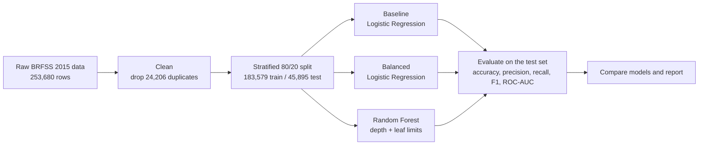

# diabetes-prediction-capstone
## Team: Nelson, Tim, Adam, Nicole, Onayiga
<h1 align="center">Diabetes Risk Prediction</h1>

<p align="center">
  <b>Predicting diabetes from 21 health and lifestyle survey answers using machine learning</b><br>
  An AI/ML course capstone built on CDC BRFSS 2015 survey data
</p>

<p align="center">
  
  
  
  
  
</p>

<p align="center">
  <a href="https://colab.research.google.com/github/YOUR-USERNAME/YOUR-REPO/blob/main/notebooks/diabetes_prediction.ipynb">
    
  </a>
</p>

<p align="center">
  <a href="#overview">Overview</a> ·
  <a href="#results">Results</a> ·
  <a href="#dataset">Dataset</a> ·
  <a href="#how-it-works">How it works</a> ·
  <a href="#limitations">Limitations</a> ·
  <a href="#run-it-yourself">Run it yourself</a> ·
  <a href="#team">Team</a>
</p>

---

## Overview

Diabetes is common, and catching it early matters. This project asks a simple question: **can a handful of everyday health and lifestyle answers, with no blood test, tell us who is more likely to have diabetes?**

We trained and compared three models on about 230,000 survey responses from the CDC's Behavioral Risk Factor Surveillance System (BRFSS): a baseline Logistic Regression, a class-balanced Logistic Regression, and a Random Forest. Along the way we hit a problem that shows up in a lot of real health data. The classes are heavily imbalanced, which makes plain accuracy misleading.

> **In short:** our baseline model looked great on paper, with 85% accuracy, but it found only 15% of the people who actually have diabetes. After balancing the classes and using a depth-limited Random Forest, the final model catches about 78% of them (ROC-AUC 0.817).

| At a glance | Details |
|---|---|
| **Task** | Binary classification: diabetes (1) or no diabetes (0) |
| **Input** | 21 health, lifestyle and demographic survey answers |
| **Data** | 229,474 survey responses after cleaning |
| **Final model** | Random Forest (100 trees, max depth 12, at least 50 samples per leaf, balanced class weights) |
| **Evaluation** | Held-out 20% test set (45,895 responses), stratified split, `random_state=42` |
| **Best result** | Recall 0.776 and ROC-AUC 0.817 |

## Results

All scores below are measured on the 45,895 responses the models never saw during training.

| Model | Accuracy | Precision | Recall | F1 | ROC-AUC |
|---|---|---|---|---|---|
| Baseline Logistic Regression | **0.851** | **0.540** | 0.154 | 0.239 | 0.810 |
| Balanced Logistic Regression | 0.714 | 0.318 | 0.759 | 0.448 | 0.811 |
| Random Forest (depth-limited, balanced) | 0.716 | 0.322 | **0.776** | **0.455** | **0.817** |

**How to read these numbers**

- **Recall:** of all the people who really have diabetes, the share the model catches.
- **Precision:** of everyone the model flags, the share who really have diabetes.
- **ROC-AUC:** how well the model ranks people from lower to higher risk, whatever cutoff is used (0.5 is a coin flip, 1.0 is perfect).

In plain words, the final model catches about 78 out of every 100 people with diabetes in the test set. The price is false alarms: only about 1 in 3 of the people it flags actually has diabetes.

### What we learned

1. **Accuracy can hide a bad model.** About 85% of respondents do not have diabetes, so a model that always answers "no" would score about 85% accuracy while catching nobody. Our baseline reached 85.1% and still missed most real cases.
2. **Class weights fixed the blind spot.** Setting `class_weight="balanced"` lifted Logistic Regression recall from 0.154 to 0.759. The trade-off was lower accuracy (85% to 71%) and lower precision (0.54 to 0.32).
3. **The Random Forest helped, but only a little.** It scored best on recall, F1 and ROC-AUC, yet it sits close to the balanced Logistic Regression. Most of the signal in this data seems to be captured by fairly simple relationships.
4. **An unconstrained forest overfits.** Our first Random Forest memorized the training data (99.5% training accuracy) and did worse on unseen data (ROC-AUC 0.779, recall 0.148). Limiting `max_depth` to 12 and `min_samples_leaf` to 50 fixed it.

### What the Random Forest relies on most

| Rank | Feature | Meaning | Importance |
|---|---|---|---|
| 1 | `HighBP` | Told they have high blood pressure | 0.226 |
| 2 | `GenHlth` | Self-rated general health (1 excellent to 5 poor) | 0.209 |
| 3 | `BMI` | Body mass index | 0.147 |
| 4 | `Age` | Age group | 0.114 |
| 5 | `HighChol` | Told they have high cholesterol | 0.104 |

The next five are `DiffWalk`, `HeartDiseaseorAttack`, `PhysHlth`, `Income` and `MentHlth`. Feature importance shows what the model leans on to make predictions. It does not prove what causes diabetes.

## Dataset

- **Source:** the CDC's [Behavioral Risk Factor Surveillance System (BRFSS)](https://www.cdc.gov/brfss/) 2015, a yearly telephone health survey of US adults.
- **File used:** `diabetes_binary_health_indicators_BRFSS2015.csv` from the [Diabetes Health Indicators Dataset on Kaggle](https://www.kaggle.com/datasets/alexteboul/diabetes-health-indicators-dataset).
- **Size:** 253,680 responses with 21 features and 1 target. We removed 24,206 duplicate rows, leaving 229,474. There are no missing values.
- **Target:** `Diabetes_binary` (0 = no diabetes, 1 = prediabetes or diabetes). After cleaning, about 15% of responses are in the positive class.

| Feature group | Columns |
|---|---|
| Health conditions | `HighBP`, `HighChol`, `Stroke`, `HeartDiseaseorAttack` |
| Body | `BMI` |
| Lifestyle | `Smoker`, `PhysActivity`, `Fruits`, `Veggies`, `HvyAlcoholConsump` |
| Healthcare access | `CholCheck`, `AnyHealthcare`, `NoDocbcCost` |
| Self-reported health | `GenHlth`, `MentHlth`, `PhysHlth`, `DiffWalk` |
| Demographics | `Sex`, `Age`, `Education`, `Income` |

## How it works



1. **Load and inspect** the data: shape, first rows, missing values, duplicates and class balance.
2. **Clean** the data by dropping duplicate rows.
3. **Split** into features and target, then into 80% training and 20% testing data with `stratify=y` so both parts keep the same diabetes ratio.
4. **Baseline:** `LogisticRegression(max_iter=1000)`.
5. **Handle the imbalance:** the same model with `class_weight="balanced"`.
6. **Random Forest:** `n_estimators=100`, `max_depth=12`, `min_samples_leaf=50`, `class_weight="balanced"`, `random_state=42`.
7. **Compare** all three models side by side and write up the results.

## Limitations

- **US adults, 2015, self-reported.** Results may not carry over to other countries, other years, or people who answer survey questions differently.
- **No lab values.** The data has no glucose or HbA1c, only history, lifestyle and demographics, which limits how well any model can do.
- **The label is a reported diagnosis.** People with undiagnosed diabetes count as "no diabetes", so the model learns from some mislabeled examples.
- **Low precision.** Balancing the classes catches more real cases, but about 2 in 3 flagged people are false alarms.
- **One split, light tuning.** We used a single train/test split with no cross-validation or extensive tuning, so small gaps between models (for example ROC-AUC 0.811 vs 0.817) should not be over-read.
- **Not a diagnostic tool.** See the disclaimer below.

## What's next

- Try gradient boosting (XGBoost or LightGBM)
- Tune the decision threshold to trade recall against precision
- Use cross-validation for more reliable comparisons
- Add explainability, such as SHAP values
- Test on newer BRFSS years or more diverse populations
- Wrap the model in a small web demo

## Run it yourself

### Option 1: Google Colab

1. Click the **Open in Colab** badge at the top of this page.
2. Download the dataset from Kaggle (link in the [Dataset](#dataset) section) and upload `diabetes_binary_health_indicators_BRFSS2015.csv` using the folder icon on the left.
3. Wait until the upload has fully finished. Running the first cell too early loads only part of the file.
4. Run all cells from top to bottom.

### Option 2: Locally

```bash
git clone https://github.com/YOUR-USERNAME/YOUR-REPO.git
cd YOUR-REPO
pip install pandas numpy scikit-learn jupyter
jupyter notebook notebooks/diabetes_prediction.ipynb
```

Put the CSV where the notebook's `pd.read_csv` line expects it, or update the path. We use `random_state=42` throughout, so you should get very similar numbers to the ones above.

## Repository structure

```text
YOUR-REPO/
├── README.md
├── notebooks/
│   └── diabetes_prediction.ipynb   # full pipeline: load, clean, model, compare, write-up
├── data/                           # put the Kaggle CSV here (not included in the repo)
└── LICENSE
```

## Acknowledgments

- The CDC and the BRFSS survey respondents for the 2015 data
- The Kaggle Diabetes Health Indicators Dataset for the cleaned version used here
- scikit-learn and pandas, the libraries behind the models and analysis
- [Instructor name] for guidance throughout the course

## Disclaimer

> [!WARNING]
> This project is for learning only. It is not medical advice and must not be used to diagnose, screen or make decisions about real people. Always talk to a qualified health professional about diabetes.

## License

Released under the MIT License. See [LICENSE](LICENSE) for details.
